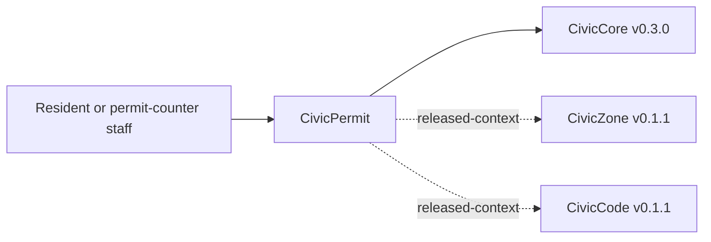

# CivicPermit User Manual

## For Residents And Municipal Decision-Makers

CivicPermit helps cities give applicants clearer pre-application guidance before a formal permit submittal. It can show sample requirement context, highlight missing or unclear intake materials for staff review, and produce records-ready permit-intake exports.

Current state: `0.1.1` permit intake foundation release. The module includes deterministic sample checks, `civiccore==0.3.0` alignment, and a public sample UI at `/civicpermit`. It does not provide legal advice, permit approvals, official completeness determinations, fee calculations, inspections, live GIS, live LLM calls, permit application ingestion, permitting-system integrations, or final staff approval.

## For IT And Technical Staff

CivicPermit is a FastAPI Python package pinned to `civiccore==0.3.0`. The current runtime exposes:

- `GET /`
- `GET /health`
- `GET /civicpermit`
- `POST /api/v1/civicpermit/requirements/lookup`
- `POST /api/v1/civicpermit/intake/review`
- `POST /api/v1/civicpermit/submittal/outline`
- `POST /api/v1/civicpermit/export`

Run local verification with:

```powershell
python -m pip install -e ".[dev]"
python -m pytest -q
bash scripts/verify-release.sh
```

## Architecture



CivicPermit depends on CivicCore. CivicCore does not depend on CivicPermit. CivicPermit v0.1.1 uses deterministic sample requirement data only; local permit-type configuration and cross-module APIs are future work.
