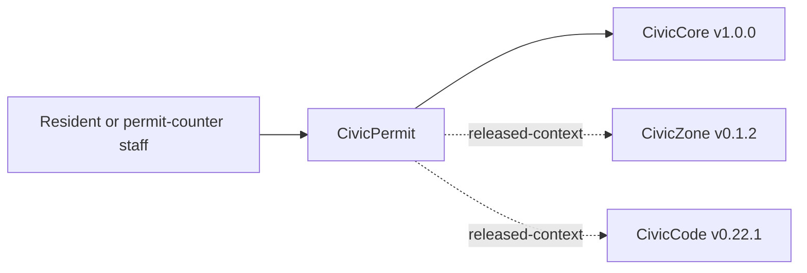

# CivicPermit User Manual

## For Residents And Municipal Decision-Makers

CivicPermit helps cities give applicants clearer pre-application guidance before a formal permit submittal. It can show sample requirement context, highlight missing or unclear intake materials for staff review, and produce records-ready permit-intake exports.

Current state: `0.1.2` permit intake foundation release plus staff-gated intake persistence and CivicCore v1 alignment. The module includes deterministic sample checks, optional database-backed requirement and intake records, `civiccore==1.0.0` alignment, staff-only persisted intake create/read routes, and a public sample UI at `/civicpermit`. It does not provide legal advice, permit approvals, official completeness determinations, fee calculations, inspections, live GIS, live LLM calls, permit application ingestion, permitting-system integrations, or final staff approval.

## For IT And Technical Staff

CivicPermit is a FastAPI Python package pinned to `civiccore==1.0.0`. The current runtime exposes:

- `GET /`
- `GET /health`
- `GET /civicpermit`
- `POST /api/v1/civicpermit/requirements/lookup`
- `POST /api/v1/civicpermit/intake/review`; persisted records require `X-CivicPermit-Role: staff` when `CIVICPERMIT_INTAKE_DB_URL` is configured
- `GET /api/v1/civicpermit/intake/{intake_id}` when `CIVICPERMIT_INTAKE_DB_URL` is configured and `X-CivicPermit-Role: staff` is present
- `POST /api/v1/civicpermit/submittal/outline`
- `POST /api/v1/civicpermit/export`

Set `CIVICPERMIT_INTAKE_DB_URL` to persist permit requirement and intake review records. Persisted intake create/read routes are staff-only and require `X-CivicPermit-Role: staff` from a trusted staff or service workflow. Leave it unset for deterministic sample behavior.

Run local verification with:

```powershell
python -m pip install https://github.com/CivicSuite/civiccore/releases/download/v1.0/civiccore-1.0.0-py3-none-any.whl
python -m pip install -e ".[dev]"
python -m pytest -q
bash scripts/verify-release.sh
```

## Architecture



CivicPermit depends on CivicCore. CivicCore does not depend on CivicPermit. CivicPermit v0.1.2 uses deterministic sample requirement data with staff-gated persistence; local permit-type configuration and production cross-module runtime consumption are future work.
