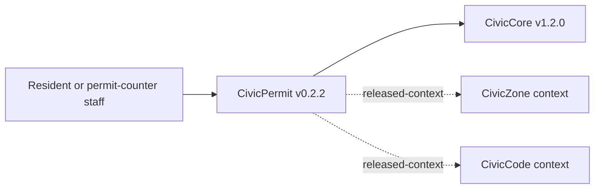

# CivicPermit User Manual

## For Residents And Municipal Decision-Makers

CivicPermit helps cities give applicants clearer pre-application guidance before a formal permit submittal. It can show requirement context, highlight missing or unclear intake materials for staff review, route deficient persisted intakes to a staff-only queue, and produce records-ready permit-intake exports.

Current state: v0.2.2 corrective demotion state. The previous v1.0.0 release was published in error. This narrow truth-repair release is no functional upgrade; it exists solely to supersede the false v1.0.0 release from 2026-05-21 in GitHub's Latest impression, with the CivicCore pin aligned to the current city-core platform. The module includes deterministic sample checks, optional database-backed requirement and intake records, local requirement CSV import, schema status, readiness gates, staff review queue workflows, review-required CivicZone/CivicCode context packet support, adversarial local integration mocks, CivicCore v1.2.0 release-wheel alignment, staff-only persisted intake create/read routes, and a public lookup UI at `/civicpermit`.

CivicPermit does not provide legal advice, permit approvals, official completeness determinations, fee calculations, inspections, live GIS, live LLM calls, permit-system writeback, or final staff approval.

## For IT And Technical Staff

CivicPermit is a FastAPI Python package pinned to the published `CivicCore v1.2.0` release wheel. The current runtime exposes:

- `GET /`
- `GET /health`
- `GET /ready`
- `GET /civicpermit`
- `GET /api/v1/civicpermit/readiness`
- `POST /api/v1/civicpermit/requirements/lookup`
- `POST /api/v1/civicpermit/context/development-review`
- `POST /api/v1/civicpermit/integrations/mock/development-review`
- `POST /api/v1/civicpermit/intake/review`; persisted records require `X-CivicPermit-Role: staff` and `X-CivicPermit-Staff-Key` when `CIVICPERMIT_INTAKE_DB_URL` is configured
- `GET /api/v1/civicpermit/intake/{intake_id}` when `CIVICPERMIT_INTAKE_DB_URL` and `CIVICPERMIT_STAFF_API_KEY` are configured and both staff headers are present
- `POST /api/v1/civicpermit/staff/reviews`
- `GET /api/v1/civicpermit/staff/reviews`
- `PATCH /api/v1/civicpermit/staff/reviews/{review_id}`
- `GET /api/v1/civicpermit/staff/reviews/summary`
- `POST /api/v1/civicpermit/submittal/outline`
- `POST /api/v1/civicpermit/export`

Set `CIVICPERMIT_INTAKE_DB_URL` to persist permit requirement, intake review, and staff queue records. Local permit requirement CSVs can be loaded with the `civicpermit-import-requirements` console script; see `docs/local-requirement-import.md` for required columns and fail-before-write validation. Use `civicpermit-db-status` with the same database URL to initialize and verify schema. Persisted staff routes require `CIVICPERMIT_STAFF_API_KEY`, `X-CivicPermit-Role: staff`, and matching `X-CivicPermit-Staff-Key` from a trusted staff workflow. CivicPermit uses CivicCore `staff_key_gate` for timing-safe key comparison. Leave it unset for deterministic sample behavior.

Before public use, check `/ready` or `/api/v1/civicpermit/readiness`. The readiness gate is `not-ready` until a local intake database is configured, the schema is ready, and local permit requirements are loaded.

Run local verification with:

```powershell
python -m pip install https://github.com/CivicSuite/civiccore/releases/download/v1.2.0/civiccore-1.2.0-py3-none-any.whl
python -m pip install -e ".[dev]"
python -m pytest -q
bash scripts/verify-release.sh
```

## Architecture



CivicPermit depends on CivicCore. CivicCore does not depend on CivicPermit. CivicPermit v0.2.2 uses deterministic sample requirement data plus optional staff-gated persistence, review-required context packets for released CivicZone/CivicCode references, staff review queue records, and adversarial local mocks for integration-depth validation.
